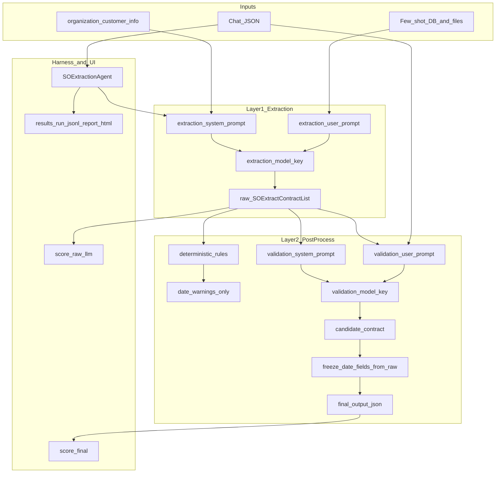

# Harness Agents

Pluggable agents for sales-order extraction from chat transcripts, benchmark harnesses, and HTML reporting.

## Architecture



## Two-layer extraction

1. **Extraction LLM** — [`core/extractor.py`](core/extractor.py) builds prompts from [`templates/extraction.j2`](templates/extraction.j2) and returns **`SOExtractContractList`** (stored as `raw_llm_output_json`).
2. **Post-processing** — [`core/postprocess_pipeline.py`](core/postprocess_pipeline.py):
   - **Deterministic**: normalize units, recalculate line `total` from `quantity × unit_price`, emit **date warnings only** (never mutates dates).
   - **Validation LLM** — separate model and prompts ([`templates/validation_system.j2`](templates/validation_system.j2), [`templates/validation_user.j2`](templates/validation_user.j2)); chat is source of truth for units and pricing.
   - **Date freeze** — all date fields copied back from the raw extraction into the final JSON.

Downstream consumers (pipelines, DB save) use **`output_json`** (final). **`raw_llm_output_json`** is kept for comparison.

## Dual scoring

[`agents/so_extraction/agent.py`](agents/so_extraction/agent.py) scores both snapshots against [`agents/so_extraction/expected_results.py`](agents/so_extraction/expected_results.py):

- `score_raw_llm` — primary model output
- `score` — final after post-processing

Harness artifacts ([`harness/artifacts.py`](harness/artifacts.py)) roll up `field_match_rate_raw_llm`, `field_match_rate_final`, and improvement metrics. **`report.html`** includes a post-processing comparison chart when those fields are present.

## Running

```bash
# Single chat
python -m harness.runner --agent so_extraction --chat raw_data/chats/single_product_single_shipment_simple.json

# Bulk with separate validation model
python -m harness.runner --agent so_extraction --bulk --datasets acme \
  --models sonnet-4-6 --validation-model gemini:gemini-2.5-flash

# Dashboard
streamlit run dashboard/app.py
```

## Graph store (FalkorDB)

The API needs FalkorDB running:

    docker compose up -d falkordb   # or: docker run -d -p 6379:6379 falkordb/falkordb

Config via env: `FALKORDB_HOST` (default `localhost`), `FALKORDB_PORT` (default `6379`).
Graph-touching tests skip automatically when FalkorDB is unreachable.

If port 6379 is already in use (e.g. from an existing `docker run` container), the API and tests can use that instance — stop the other container first if you need compose to bind the port.

## Chat Simulation

A React + FastAPI app for role-playing sales conversations with 3 fixed customers,
building per-customer FalkorDB graphs and a shared catalog graph, and generating LLM sales-order summaries.

### Prerequisites

- Python 3.13+ with repo dependencies installed (`pip install -r requirements.txt`)
- Node.js 18+ and npm
- MongoDB running and reachable

### Environment

Add to `.env` (or use the defaults):

```
MONGODB_URI=mongodb://localhost:27017
MONGO_DB_NAME=chat_sim
WEB_ORIGIN=http://localhost:5173
FALKORDB_HOST=localhost
FALKORDB_PORT=6379
```

Existing LLM API keys in `.env` are reused for summary generation.

### Run

```bash
cd apps/web && npm install
cd ../..
python run.py
```

- API docs: http://localhost:8000/docs
- Web UI: http://localhost:5173

One Ctrl+C stops both servers.

### Usage

1. Pick a customer (`dummy-01`, `dummy-02`, `dummy-03`) and an LLM model.
2. Toggle **Me** / **Customer** and post chat messages describing an order.
3. `/create-sales-order` — builds the chat-facts graph (Step A), then generates a pending summary (Step B).
4. `/edit <instructions>` — revises the pending summary.
5. `/approve` — finalizes the summary and advances the contract checkpoint.
6. Edit customer profile fields in the details panel (updates Mongo profile and resyncs FalkorDB attribute nodes).
7. Use the **Products** tab to edit or delete catalog entries.

Each customer gets an isolated FalkorDB graph (`customer:<id>`); the product catalog lives in a shared `catalog` graph. Profile attributes are stored in FalkorDB alongside chat-derived contract data.

### Tests

```bash
PYTHONPATH=. pytest tests/api -v
cd apps/web && npm run test
```

## Key files

| Area | Path |
|------|------|
| Chat API | [`apps/api/main.py`](apps/api/main.py) |
| Chat web | [`apps/web/src/App.tsx`](apps/web/src/App.tsx) |
| Dev launcher | [`run.py`](run.py) |
| Schemas | [`core/models.py`](core/models.py), [`core/validation_models.py`](core/validation_models.py) |
| Post-process | [`core/postprocess_pipeline.py`](core/postprocess_pipeline.py) |
| Agent | [`agents/so_extraction/agent.py`](agents/so_extraction/agent.py) |
| Runner | [`harness/runner.py`](harness/runner.py) |
| Reports | [`harness/report_dashboard_html.py`](harness/report_dashboard_html.py) |
| UI | [`dashboard/app.py`](dashboard/app.py) |
