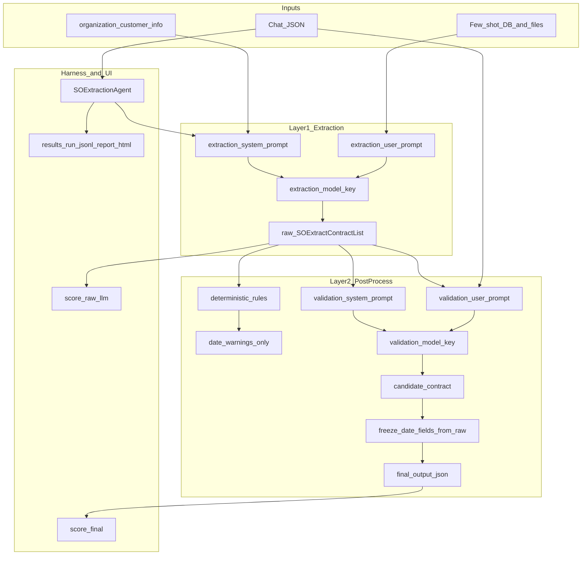

# Harness Agents

Pluggable agents for sales-order extraction from chat transcripts, benchmark harnesses, and HTML reporting.

## Architecture



## Two-layer extraction

1. **Extraction LLM** — [`core/extractor.py`](core/extractor.py) builds prompts from [`templates/extraction.j2`](templates/extraction.j2) and returns **`SOExtractContractList`** (stored as `raw_llm_output_json`).
2. **Post-processing** — [`core/postprocess_pipeline.py`](core/postprocess_pipeline.py):
   - **Deterministic**: normalize units, recalculate line `total` from `quantity × unit_price`, emit **date warnings only** (never mutates dates).
   - **Validation LLM** — separate model and prompts ([`templates/validation_system.j2`](templates/validation_system.j2), [`templates/validation_user.j2`](templates/validation_user.j2)); chat is source of truth for units and pricing.
   - **Date freeze** — all date fields copied back from the raw extraction into the final JSON.

Downstream consumers (pipelines, DB save) use **`output_json`** (final). **`raw_llm_output_json`** is kept for comparison.

## Dual scoring

[`agents/so_extraction/agent.py`](agents/so_extraction/agent.py) scores both snapshots against [`agents/so_extraction/expected_results.py`](agents/so_extraction/expected_results.py):

- `score_raw_llm` — primary model output
- `score` — final after post-processing

Harness artifacts ([`harness/artifacts.py`](harness/artifacts.py)) roll up `field_match_rate_raw_llm`, `field_match_rate_final`, and improvement metrics. **`report.html`** includes a post-processing comparison chart when those fields are present.

## Running

```bash
# Single chat
python -m harness.runner --agent so_extraction --chat raw_data/chats/single_product_single_shipment_simple.json

# Bulk with separate validation model
python -m harness.runner --agent so_extraction --bulk --datasets acme \
  --models sonnet-4-6 --validation-model gemini:gemini-2.5-flash

# Dashboard
streamlit run dashboard/app.py
```

## Key files

| Area | Path |
|------|------|
| Schemas | [`core/models.py`](core/models.py), [`core/validation_models.py`](core/validation_models.py) |
| Post-process | [`core/postprocess_pipeline.py`](core/postprocess_pipeline.py) |
| Agent | [`agents/so_extraction/agent.py`](agents/so_extraction/agent.py) |
| Runner | [`harness/runner.py`](harness/runner.py) |
| Reports | [`harness/report_dashboard_html.py`](harness/report_dashboard_html.py) |
| UI | [`dashboard/app.py`](dashboard/app.py) |
