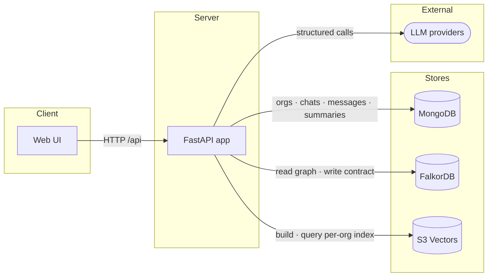
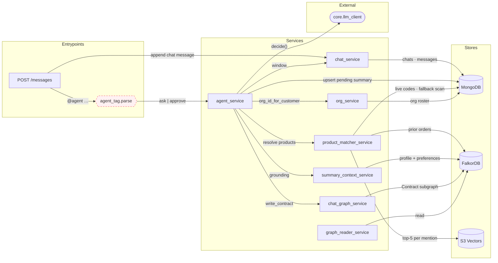

<!--
  GENERATED FILE — do not edit by hand.
  Source: apps/web/src/architecture/spec.ts
  Regenerate: cd apps/web && npm run gen:arch
-->

# Customer-Chat Agent — Architecture

Three views of the agent under `apps/`. For the prose walkthrough, see
[`customer-chat-agent.md`](customer-chat-agent.md). For an interactive version with
click-to-inspect and flow highlighting, open the **Architecture** tab in the web app
(`cd apps/web && npm run dev`).

Dashed red edges are **early returns** — the points where the agent stops and asks
instead of proceeding.

## System context

What the system is made of and what it talks to.

### Components

#### Web UI

`apps/web/src/App.tsx::App`

React 19 + Vite single-page app. Routed shell: Chat, Organizations, Products, Graphs, Architecture. Refetches the message list after every send (no background polling) and renders draft/final contract cards.

**Reads:** `GET /api/customers`, `GET /api/customers/{id}/messages`, `GET /api/customers/{id}/graph`, `GET /api/orgs`, `GET /api/products`, `GET /api/models`

**Writes:** `POST /api/customers/{id}/messages`

#### FastAPI app

`apps/api/main.py::app`

Wires every router: customers, products, chats, messages, models, organizations, graphs. CORS is restricted to WEB_ORIGIN. On startup a lifespan hook ensures the Mongo indexes and seeds the org roster.

#### MongoDB

`apps/api/db/mongo.py::db`

Live mutable state. Collections: customers, organizations, chats, messages, summaries, products. The current draft contract lives here as a pending summary until it is approved.

> **Invariant:** Everything before finalize lives in Mongo, not the graph.

#### FalkorDB

`apps/api/db/falkor.py::customer_graph`

The knowledge graph — committed truth only. One graph per customer (customer:<id>); there is no shared catalog graph, the catalog lives in S3 Vectors. Contract data is written only at finalize time.

> **Invariant:** Guarded by falkor.is_available() everywhere; if it is down, grounding is empty and the agent degrades to chat-only reasoning rather than erroring.

#### S3 Vectors

`apps/api/db/vectors.py::S3VectorsIndex`

The product catalog as embeddings — one index per organization, named {S3_VECTOR_INDEX}-{slug} and stored on the org document. The agent only ever queries the index belonging to the customer's org.

> **Invariant:** is_available() is just "is S3_VECTOR_BUCKET set"; when it is not, the matcher falls back to a substring scan over Mongo so the app still works offline.

#### LLM providers

`core/llm_client.py::call_llm`

Bedrock / Anthropic / OpenAI / Gemini behind one call. Uses instructor to coerce every response into a Pydantic schema. Model chosen per-request via model_key through core.utils.MODEL_CATALOG.

## Request flows

Which code runs when a request hits each entrypoint.

### Components

#### POST /messages

`apps/api/routers/messages.py::post_message`

The only entrypoint. Appends one kind="chat" message, then parses the body for an @agent tag and runs the agent when it finds one. Returns {messages, summary} either way.

#### agent_tag.parse

`apps/api/services/agent_tag.py::parse`

Deterministic keyword gate. "@agent confirm|finalize|approve" → approve; any other "@agent …" → ask; untagged → the message is just appended.

> **Invariant:** Finalization is never model-decided — only an explicit confirm word commits.

#### agent_service

`apps/api/services/agent_service.py::invoke`

The agent itself: invoke() drafts or asks, approve() finalizes, finalize() commits a decision directly. Reached only through an @agent tag on a chat message.

> **Invariant:** Never auto-commits. A ready_to_finalize decision still only drafts.

#### chat_service

`apps/api/services/chat_service.py::ensure_active_chat`

Chat lifecycle and the message window. Assigns per-chat monotonic seq numbers, reuses or opens the active chat, and slices messages since the last contract watermark.

#### org_service

`apps/api/services/org_service.py::org_id_for_customer`

Organization lookups: the roster, slugs, and which vector index an org owns. Raises MissingOrg when a customer or product reaches org-scoped code without an org_id.

> **Invariant:** vector_index_name() reads the name stored on the org document, so changing S3_VECTOR_INDEX later cannot orphan existing vectors.

#### product_matcher_service

`apps/api/services/product_matcher_service.py::resolve_products`

Resolves product mentions to catalog SKUs in two LLM calls: one extracts distinct mentions, one resolves them. The candidate pool is the customer's organization S3-Vectors index plus this customer's prior orders, and each mention comes back confident, ambiguous, or no_match.

> **Invariant:** _guard() drops any resolved_code outside the pool — product codes are never invented.

#### summary_context_service

`apps/api/services/summary_context_service.py::assemble`

Assembles grounding from FalkorDB: profile_block from Attribute nodes and history_block from Preference nodes, both None when FalkorDB is unavailable. product_block is left empty here — agent_service overwrites it with the resolved SKUs.

#### chat_graph_service

`apps/api/services/chat_graph_service.py::write_contract`

The only writer of contract data into the customer graph. Creates the Contract subgraph and derives Preference nodes from both-agreed slots.

#### graph_reader_service

`apps/api/services/graph_reader_service.py::read_customer_graph`

Reads one customer's graph into {nodes, edges} for the UI's Graphs tab. Returns an empty graph when FalkorDB is unreachable.

#### MongoDB

`apps/api/db/mongo.py::db`

customers, organizations, products, chats, messages, summaries. The pending draft and the message window both live here.

#### FalkorDB

`apps/api/db/falkor.py::customer_graph`

Read for grounding on every draft; written only on approve.

#### S3 Vectors

`apps/api/db/vectors.py::S3VectorsIndex`

Per-org product embeddings. Queried top-5 per mention; falls back to a Mongo substring scan when unset or erroring.

#### core.llm_client

`core/llm_client.py::call_llm`

Schema-coerced LLM calls: MentionList and ProductMatchResult for matching, AgentDecision for drafting, plus OrgChoice and ProductSpec off the request path.

## Agent internals

How a draft gets made, and what gates a commit.

```mermaid
flowchart LR
  subgraph Draft_pipeline["Draft pipeline"]
    agent_invoke["invoke()"]
    agent_ensure_chat["ensure_active_chat"]
    agent_window["messages_since(watermark)"]
    agent_gate_empty{{"GATE · empty window"}}
    agent_gate_noorg{{"GATE · customer has no org"}}
    agent_match["resolve_products"]
    agent_gate_unresolved{{"GATE · unresolved products"}}
    agent_context["assemble context"]
    agent_previous["load pending draft"]
    agent_decide(["decide() → AgentDecision"])
    agent_verify["verify(decision)"]
    agent_gate_verify{{"GATE · blocking violation"}}
    agent_gate_clarify{{"GATE · mode == clarify"}}
    agent_draft["upsert draft + post card"]
  end
  subgraph Commit_pipeline["Commit pipeline"]
    agent_approve["approve()"]
    agent_gate_nodraft{{"GATE · no pending draft"}}
    agent_gate_ready{{"GATE · is_ready(slots)"}}
    agent_verify_commit["verify(pending)"]
    agent_gate_verify_commit{{"GATE · failed verification"}}
    agent_write["write_contract"]
    agent_persist["persist + final card"]
    agent_branch["_finish_and_branch"]
  end
  agent_invoke --> agent_ensure_chat
  agent_ensure_chat --> agent_window
  agent_window -.->|"no new messages"| agent_gate_empty
  agent_window -.->|"customer has no org_id"| agent_gate_noorg
  agent_window --> agent_match
  agent_match -.->|"ambiguous / no_match"| agent_gate_unresolved
  agent_match -->|"all confident"| agent_context
  agent_context --> agent_previous
  agent_previous --> agent_decide
  agent_decide -.->|"needs answers"| agent_gate_clarify
  agent_decide -->|"draft | finalize"| agent_verify
  agent_verify -.->|"ungrounded / malformed"| agent_gate_verify
  agent_verify -->|"clean / warnings stored"| agent_draft
  agent_draft -->|"@agent confirm (separate request)"| agent_approve
  agent_approve -.->|"no pending summary"| agent_gate_nodraft
  agent_approve --> agent_gate_ready
  agent_gate_ready -->|"all critical slots agreed"| agent_verify_commit
  agent_verify_commit -.->|"failed verification"| agent_gate_verify_commit
  agent_verify_commit -->|"verified"| agent_write
  agent_write --> agent_persist
  agent_persist --> agent_branch
  classDef gate stroke:#f43f5e,stroke-dasharray:5 4,fill:#fff1f2;
  class agent_gate_empty,agent_gate_noorg,agent_gate_unresolved,agent_gate_verify,agent_gate_clarify,agent_gate_nodraft,agent_gate_ready,agent_gate_verify_commit gate;
```

### Components

#### invoke()

`apps/api/services/agent_service.py::invoke`

Entry to the draft loop. Every dependency (decider, context_fn, graph_fn, matcher_fn) is injectable.

#### ensure_active_chat

`apps/api/services/chat_service.py::ensure_active_chat`

Reuses the non-finished chat, or opens "Chat N".

#### messages_since(watermark)

`apps/api/services/chat_service.py::messages_since`

Slices messages after last_contract_seq, limited to kinds chat, question, draft, final.

> **Invariant:** last_contract_seq is the watermark — after finalize it advances, so the next order reasons over a clean window.

#### GATE · empty window

`apps/api/services/agent_service.py::invoke`

No new messages since the last contract → post a plain chat message and return.

#### GATE · customer has no org

`apps/api/services/org_service.py::MissingOrg`

org_id_for_customer raises MissingOrg → post a question telling the user to assign an organization on the Organizations page, and return. Product lookup is org-scoped, so there is no catalog to search without one.

#### resolve_products

`apps/api/services/product_matcher_service.py::resolve_products`

Pins every product mention to a SKU in the customer's own organization catalog before any drafting happens. Prior-order codes from the graph are filtered to that org's live codes first, so another org's SKUs can never enter the pool.

#### GATE · unresolved products

`apps/api/services/agent_service.py::_match_question`

Any ambiguous or unmatched mention → post a question card asking which SKU, and return.

> **Invariant:** The agent will not draft until products are pinned down.

#### assemble context

`apps/api/services/summary_context_service.py::assemble`

profile_block from graph Attribute nodes, history_block from Preference nodes. agent_service then overwrites product_block with the resolved SKUs, so the model sees the pinned catalog rows rather than the whole catalog.

#### load pending draft

`apps/api/services/agent_service.py::_pending`

An existing pending summary is passed back to the model as previous_json so drafts revise rather than restart.

#### decide() → AgentDecision

`apps/api/services/agent_service.py::decide`

The LLM call. Returns mode, message, questions, contract, ledger, ready_to_finalize. Questions are capped at 3 with critical slots first.

> **Invariant:** mode=="finalize" without readiness is downgraded to "draft".

#### verify(decision)

`apps/api/verification.py::verify`

Deterministic verification gate over the model's decision before anything is drafted. Checks product-code grounding (a line item's description must be a matcher-resolved SKU or name), ship_term ∈ {EXW,FOB,CIF,DDP}, total == quantity×unit_price, ISO dates, and per-slot provenance (source, source_seqs). Blocking violations become a question; warnings are stored on the draft.

> **Invariant:** Blocking codes (unknown_product_code, bad_ship_term, critical_unknown_source, missing_provenance) stop a draft; warnings (total_mismatch, bad_date_format, stale_citation) are recorded, not fatal.

#### GATE · blocking violation

`apps/api/verification.py::has_blocking`

A blocking violation (ungrounded product, bad incoterm, or a critical slot with source='unknown') → post a question listing the problems, write no summary, and return.

#### GATE · mode == clarify

`apps/api/services/agent_service.py::invoke`

The model needs answers → post a question card, write no summary, and return.

#### upsert draft + post card

`apps/api/models.py::render_summary_markdown`

Renders the contract to markdown, upserts the pending summary with slots, product_matches and any verification warnings, bumps revision, posts a draft card.

> **Invariant:** A ready decision still only drafts — it appends "Ready to finalize" and waits for @agent confirm.

#### approve()

`apps/api/services/agent_service.py::approve`

The only path that writes a contract to the graph.

#### GATE · no pending draft

`apps/api/services/agent_service.py::approve`

Nothing to finalize → reply telling the user to run @agent create sales order first.

#### GATE · is_ready(slots)

`apps/api/models.py::is_ready`

The hard commit gate. Every critical slot (description, quantity, unit_price, ship_term) must be agreed by BOTH seller and customer. Otherwise reply listing what is missing and stop.

> **Invariant:** This is the single gate preventing an unagreed contract from reaching the graph.

#### verify(pending)

`apps/api/verification.py::verify`

The same deterministic verifier, re-run on the stored pending draft at commit time (resolved_codes=None, so product grounding is trusted from draft time). A blocking violation refuses the finalize.

> **Invariant:** is_ready proves both parties agreed; verify proves the contract is well-formed. Both must pass before write_contract.

#### GATE · failed verification

`apps/api/verification.py::has_blocking`

The pending draft failed verification → reply listing the blocking problems and stop, without writing the graph.

#### write_contract

`apps/api/services/chat_graph_service.py::write_contract`

Creates Contract, one LineItem per item, Term nodes, and SUPERSEDES to the prior revision. Writes per-line MessageRef provenance: each LineItem/Term gets DERIVED_FROM edges to the exact messages its own line's slots cite (source_seqs, scoped by the slot's line == item sr_no), with evidence stored on the MessageRef. Derives a Preference node for every both-agreed slot.

> **Invariant:** Preferences are the feedback loop — they reappear as history_block grounding on the next draft.

#### persist + final card

`apps/api/services/agent_service.py::_persist_final`

Flips the summary to approved and advances chat.last_contract_seq to the draft's to_seq.

#### _finish_and_branch

`apps/api/services/agent_service.py::_finish_and_branch`

Marks the chat finished, opens "Chat N+1", and links newChat -CONTINUES-> oldChat. Renders in the UI as the contract-finalized checkpoint divider.

