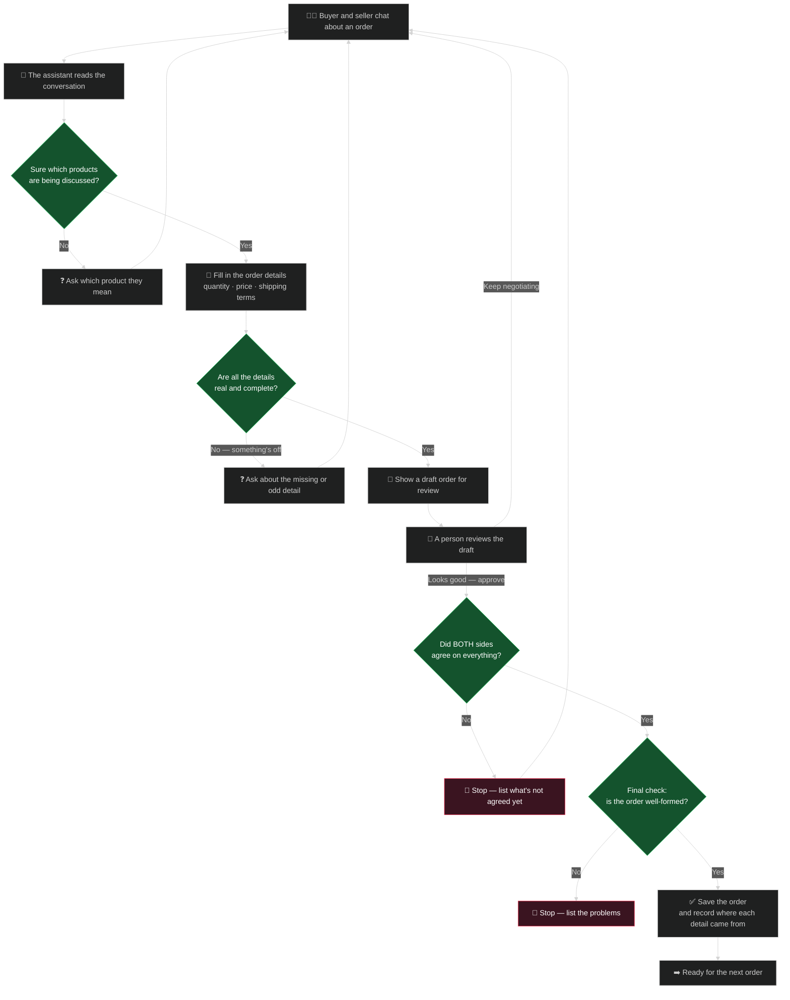
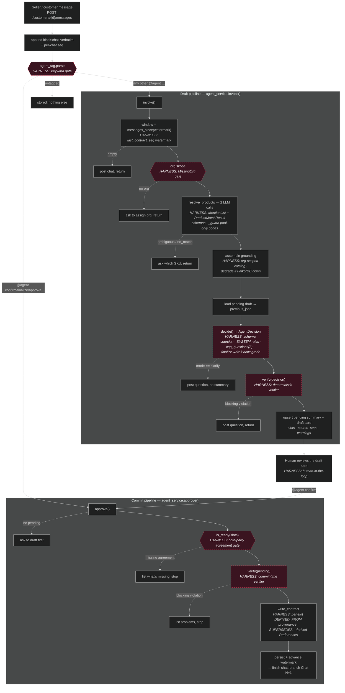
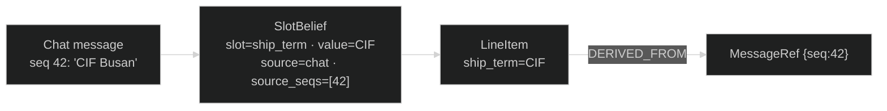

# Contract Agent — Steps & Harness

This document walks the **live contract agent** (`apps/`) one step at a time and
names the **harness** attached to each step.

> **Two different "harnesses" live in this repo — don't confuse them.**
> - *This* doc is about the **agent runtime harness**: the schemas, gates,
>   validators, provenance and human approval that wrap the probabilistic model
>   so its output is reliable. This is the "harness" the source articles mean —
>   *"the prompts, examples, schemas, validators, evals, and guardrails that sit
>   between a probabilistic model and the person using your product."*
> - The **benchmark/eval harness** (`harness/runner.py`, scoring, reports) is a
>   separate offline system, documented in
>   [`harness-architecture.md`](harness-architecture.md).
>
> For the code walkthrough see [`customer-chat-agent.md`](customer-chat-agent.md);
> for the three-view architecture diagrams see [`architecture.md`](architecture.md).

---

## Why the harness exists

The model is not the product. A drafted contract that is 95% right and 5% wrong
*looks* completely fine — there is no exception, no stack trace. So every value
the model produces is wrapped by deterministic machinery that makes the invisible
visible and refuses to commit anything that isn't grounded, well-formed, and
agreed by both parties. Concretely, the harness is five kinds of guardrail:

| Harness kind | What it does | Where |
|---|---|---|
| **Structured output** | Every LLM call is coerced into a Pydantic schema via `instructor` — no free text | `core/llm_client.py::call_llm` |
| **Deterministic gates** | Constraints enforced in *code*, never prose, so they can't be contradicted | `agent_tag`, `is_ready`, `verify`, `_guard` |
| **Verification** | Post-decision checks that surface silent/graded errors | `apps/api/verification.py::verify` |
| **Provenance** | Every critical value carries its source message ("lot number") | `SlotBelief.source_seqs` → `MessageRef` `DERIVED_FROM` |
| **Human-in-the-loop** | Finalizing is a human keyword action, gated on both-party agreement | `@agent confirm` + `is_ready` |

---

## The order journey — plain language

For a non-technical reader: this is what the assistant does, start to finish. The
**green diamonds are safety checks** — the assistant refuses to move forward until
each one passes. It can *draft* on its own, but only a **person can approve**, and
nothing is saved unless every check passes.

**The four safety checks, in plain words:**

1. **Do we know the real product?** — the assistant only uses products from the
   real catalogue; it never makes one up. If it's unsure, it asks.
2. **Are the details valid and complete?** — prices add up, shipping terms are
   real, dates make sense, and every number traces back to something someone
   actually said.
3. **Did both sides really agree?** — the buyer *and* the seller must each have
   agreed to the key terms before anything can be finalized.
4. **Is the final order well-formed?** — one last automatic re-check before saving.

And two rules that never bend: the assistant **never finalizes on its own** (a
person has to say "confirm"), and every saved detail keeps a **note of the exact
message it came from**, so you can always answer "where did this number come from?"

---

## End-to-end flow — technical (with the harness annotated)

Dashed arrows are **early returns** — the agent stops and asks instead of proceeding.

---

## Step by step

Each step lists **what the agent does** and **the harness attached**.

### 1. Message intake
- **Does:** `POST /messages` appends the message as `kind="chat"`, verbatim, with a
  per-chat monotonic `seq`. `agent_tag.parse(body)` then routes it.
- **Harness — deterministic keyword gate:** `@agent confirm|finalize|approve` →
  `approve()`; any other `@agent …` → `invoke()`; untagged → just stored.
  Finalization is *never* model-decided, so a paraphrase like "looks good" cannot
  commit an order. `apps/api/services/agent_tag.py::parse`.

### 2. Window slice
- **Does:** `messages_since(last_contract_seq)` slices only the messages since the
  last committed contract, limited to kinds `chat/question/draft/final`.
- **Harness — watermark:** `last_contract_seq` advances after every finalize, so
  each new order reasons over a clean window. An empty window returns early.
  `apps/api/services/chat_service.py::messages_since`.

### 3. Org scope
- **Does:** resolves the customer's organization.
- **Harness — MissingOrg gate:** product lookup is org-scoped; with no org there
  is no catalog to search, so the turn stops and asks the user to assign one.
  `apps/api/services/org_service.py::MissingOrg`.

### 4. Product matching
- **Does:** two LLM calls — one extracts distinct product mentions
  (`MentionList`), one resolves each to a catalog SKU (`ProductMatchResult`),
  labelling every mention `confident | ambiguous | no_match`. The candidate pool
  is the org's S3-Vectors index plus this customer's prior orders.
- **Harness — schema coercion + anti-hallucination:** `_guard()` drops any
  `resolved_code` outside the pool, so **product codes are never invented**. Any
  `ambiguous`/`no_match` → the agent asks which SKU and does not draft.
  `apps/api/services/product_matcher_service.py::resolve_products`.

### 5. Grounding assembly
- **Does:** builds `profile_block` (Attribute nodes), `history_block` (Preference
  nodes), and overwrites `product_block` with the resolved SKUs so the model sees
  pinned rows, not the whole catalog.
- **Harness — context scoping + graceful degradation:** everything is org-scoped;
  if FalkorDB is down, grounding blocks are `None` and the agent degrades to
  chat-only reasoning rather than erroring.
  `apps/api/services/summary_context_service.py::assemble`.

### 6. Decide
- **Does:** one LLM call returns an `AgentDecision` — `mode`, `message`,
  `questions`, `contract`, `ledger` (per-slot beliefs), `ready_to_finalize`.
- **Harness — structured output + prompt guardrails:** `instructor` coerces the
  response into the schema; `cap_questions()` caps questions at 3 (critical
  slots first); `mode=="finalize"` without readiness is downgraded to `"draft"`.
  `apps/api/services/agent_service.py::decide`.

### 7. Verify (draft-time) — **the new harness gate**
- **Does:** runs `verify(decision)` before anything is drafted.
- **Harness — deterministic verification:** checks
  - **product grounding** — a line item's `description` must be a matcher-resolved
    SKU or name (blocking `unknown_product_code`);
  - **ship_term** ∈ {EXW, FOB, CIF, DDP} (blocking `bad_ship_term`);
  - **critical-slot source** — a critical slot with a value but `source="unknown"`
    (blocking `critical_unknown_source`);
  - **arithmetic** — `total == quantity × unit_price` (warn `total_mismatch`);
  - **dates** — ISO `YYYY-MM-DD` (warn `bad_date_format`);
  - **provenance** — a chat-sourced critical slot that cites no message
    (warn `missing_provenance`) or cites a message outside the window
    (warn `stale_citation`).

  **Blocking** violations turn into a question and write no draft; **warnings**
  are stored on the draft for observability. `apps/api/verification.py::verify`,
  wired at `agent_service.py::invoke` (this gate is skipped on the `clarify` path
  so questions still surface).

### 8. Draft
- **Does:** renders the contract to markdown, upserts the pending summary
  (`status: pending`, `revision++`), and posts a draft card.
- **Harness — never auto-commits + observability:** a `ready` decision still only
  drafts ("Ready to finalize — send `@agent confirm`"). The summary stores
  `slots`, `product_matches`, and `violations`; the card carries the raw decision
  JSON. `apps/api/services/agent_service.py::invoke`.

### 9. Human review (out of band)
- **Does:** the seller reads the draft card and either keeps negotiating
  (re-invoke `@agent`, drafts revise) or confirms.
- **Harness — human-in-the-loop + accountability:** committing requires a human
  to type `@agent confirm`. This is the party who "takes the call" for the
  finalized contract.

### 10. Approve → readiness gate
- **Does:** `approve()` loads the pending draft.
- **Harness — the hard commit gate:** `is_ready(slots)` requires **every** critical
  slot (`description, quantity, unit_price, ship_term`) to be `agreed_by` **both**
  seller and customer; otherwise it lists what's missing and stops.
  `apps/api/models.py::is_ready`.

### 11. Verify (commit-time) — **the new harness gate**
- **Does:** re-runs `verify(pending)` on the stored draft (`resolved_codes=None`,
  so product grounding is trusted from draft time).
- **Harness — belt-and-suspenders:** `is_ready` proves *agreement*; `verify`
  proves the contract is *well-formed*. Both must pass before any graph write.
  A blocking violation refuses the finalize. `agent_service.py::approve`.

### 12. Write contract (the only graph write)
- **Does:** creates `Contract → LineItem → OF_PRODUCT/SHIP_TO`, `Term` nodes,
  `SUPERSEDES` to the prior revision, and derives a `Preference` for every
  both-agreed slot.
- **Harness — provenance / lot number:** each `LineItem` and `Term` gets
  `DERIVED_FROM` edges to `MessageRef {contract_id, seq}` nodes for the exact
  messages its slots cite (`source_seqs`). Every committed value can be traced
  back to the message that justified it.
  `apps/api/services/chat_graph_service.py::write_contract`.

### 13. Persist & branch
- **Does:** flips the summary to `approved`, advances `last_contract_seq`, finishes
  the chat, and opens `Chat N+1` linked `CONTINUES` to the old one.
- **Harness — clean-window invariant + feedback loop:** the watermark advance
  means the next order starts fresh; derived `Preference` nodes reappear as
  `history_block` grounding on future drafts.
  `apps/api/services/agent_service.py::_finish_and_branch`.

---

## Provenance model (the "lot number")

Every critical contract value can answer *"where did this come from?"* through
two linked records:

- **At draft time** — `SlotBelief` (`apps/api/models.py`) carries `value`,
  `source` (`chat|last_order|profile|inferred|unknown`), `confidence`,
  `agreed_by`, **`source_seqs`** (the message seqs that justify the value) and
  **`evidence`** (the verbatim snippet). The verifier enforces that a chat-sourced
  critical slot actually cites a message.
- **At commit time** — `write_contract` turns those `source_seqs` into graph
  edges: `LineItem`/`Term -[:DERIVED_FROM]-> MessageRef {seq}`. Provenance is
  produced *as a byproduct of production*, not documented after the fact.

---

## Harness inventory (quick reference)

| Mechanism | Purpose | Anchor |
|---|---|---|
| `agent_tag.parse` | keyword routing; finalize is never model-decided | `services/agent_tag.py` |
| `call_llm` + Pydantic schemas | all output structured, no free text | `core/llm_client.py` |
| `_guard` | product codes never invented | `services/product_matcher_service.py` |
| `cap_questions` | ≤3 questions, criticals first | `models.py` |
| finalize→draft downgrade | model can't self-authorize commit | `services/agent_service.py::decide` |
| `verify` / `has_blocking` / `Violation` | deterministic correctness checks (draft + commit) | `apps/api/verification.py` |
| `SlotBelief.source_seqs` / `evidence` | per-value provenance | `models.py` |
| `DERIVED_FROM` per-slot edges | provenance in the graph | `services/chat_graph_service.py` |
| `is_ready` / `missing_agreement` | both-party agreement gate | `models.py` |
| `@agent confirm` | human-in-the-loop commit | `services/agent_tag.py` |
| `falkor.is_available()` guards | graceful degradation | throughout |
| injectable `decider/context_fn/graph_fn/matcher_fn` | testable + eval-able without network | `services/agent_service.py` |

## What is deterministic vs agentic

- **Agentic (the model decides):** which products are mentioned, how to resolve
  them, what the slot values are, whether to ask or draft, how to phrase questions.
- **Deterministic (code decides):** routing, org scoping, whether products are
  resolved, whether the draft is well-formed (`verify`), whether both parties
  agreed (`is_ready`), whether to commit (`@agent confirm`), and how provenance is
  recorded.

The guarantee that a committed contract is grounded, well-formed, and agreed lives
entirely in the deterministic harness and the human's confirm — never in the model.
