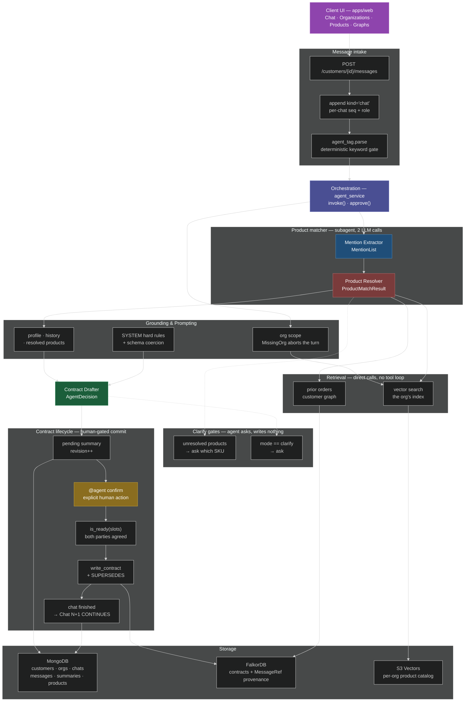
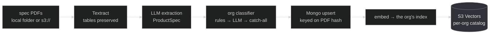

# Customer-Chat Agent — Developer Guide

How the "new agent" in `apps/` works end to end: what it does, the request paths
that reach it, the services it orchestrates, the three data stores it reads/writes,
and how the result renders in the web UI.

It lives entirely under `apps/` and reuses the `core/` extraction library for LLM
calls, embeddings, and contract schemas.

---

## System at a glance

One request, top to bottom. For the same system sliced into three layered views
(system context / request flows / agent internals) see
[`architecture.md`](architecture.md).



### Two things this diagram deliberately does *not* show

If you are comparing against a typical agent architecture diagram, two familiar
boxes are missing because they do not exist in this codebase:

- **No "Tool Execution" layer.** `core.llm_client.call_llm` takes a prompt and a
  Pydantic schema and returns one structured object. There is no tool registry,
  no tool-result message, and no loop. Vector search, graph reads and Mongo
  writes are ordinary Python calls the orchestrator makes in a fixed order — the
  model never chooses to invoke them.
- **No "Input Processing" stage.** `chat_service.add_message` stores the body
  verbatim; it assigns a per-chat `seq`, a `kind` and a `role`, and nothing else.
  There is no chunk detection, message normalization or speaker inference.

What *is* real, and is the load-bearing part of the design, is the
**human-in-the-loop gate**: finalizing is never model-decided. `@agent confirm`
is a deterministic keyword check, and even then `is_ready(slots)` must confirm
both parties explicitly agreed every critical slot.

### The offline catalog pipeline

Products reach the catalog through a separate path that never runs during a
chat request:



Full detail in [`embeddings-and-vector-search.md`](embeddings-and-vector-search.md).

---

## 1. What the agent is

The agent is a **neutral contract-drafting participant in a group chat** between a
seller ("me") and a customer. It watches the conversation, resolves which catalog
products are being discussed, tracks a per-slot ledger of the deal terms, and:

- **asks** the minimum set of clarifying questions when critical terms are unknown,
- **drafts** a structured sales-order contract once the critical terms are known,
- **finalizes** the contract into a knowledge graph once both parties have agreed,
  then starts a fresh chat "branch" for the next order.

It never auto-finalizes. A draft always waits for an explicit `@agent confirm` /
`approve` action before it is committed to the graph.

---

## 2. Where everything lives (file map)

```
apps/api/
  main.py                         # FastAPI app; wires all routers; lifespan seeds indexes + org roster
  models.py                       # Pydantic I/O + AgentDecision, SlotBelief, readiness helpers, markdown renderer
  settings.py                     # env: mongo url, falkordb host/port, web origin, S3/vector config
  orgs.py                         # the fictional selling organizations seeded into Mongo
  seed.py                         # idempotent seed + migrations (products, customer→org assignment)

  routers/
    messages.py                   # POST a chat message; an @agent tag runs the agent  ← the only entrypoint
    chats.py                      # list/create chats, list chat messages
    organizations.py              # org CRUD + per-org embedding build
    customers.py, products.py, graphs.py, models_router.py

  services/
    agent_service.py              # ★ THE AGENT: invoke() / finalize() / approve()
    agent_tag.py                  # parses "@agent …" → "ask" | "approve" | None (pure, no I/O)
    product_matcher_service.py    # resolve product mentions → catalog SKUs (LLM + vectors + graph prior)
    summary_context_service.py    # assemble grounding context (profile + history blocks)
    chat_service.py               # Mongo chats & messages: seq numbers, windows, chat lifecycle
    chat_graph_service.py         # ★ write finalized contract into the customer knowledge graph
    graph_reader_service.py       # read the customer graph → {nodes, edges} for the UI
    profile_graph_service.py      # customer profile ↔ graph attributes
    org_service.py                # org roster, slugs, per-org vector index names, MissingOrg
    org_classifier_service.py     # product → org: deterministic rules, LLM on a miss
    product_embedding_service.py  # render → embed → write vectors; build status; cross-org moves
    spec_ingest_service.py        # spec PDFs → Textract → LLM → product records (offline CLI path)

  db/
    mongo.py                      # collections: customers, organizations, chats, messages, summaries, products
    falkor.py                     # FalkorDB (graph) client; one graph per customer
    vectors.py                    # S3VectorsIndex + InMemoryIndex behind one interface

core/                             # reused extraction library (NOT app-specific)
  llm_client.py                   # call_llm(prompt, schema, model_key, system_prompt) via instructor
  models.py                       # SOExtractContractList / SOUpdateContractList contract schemas
  embeddings.py                   # text-embedding-3-large client (3072-dim)
  utils.py                        # MODEL_CATALOG, provider clients, model resolution

apps/web/src/
  api/client.ts                   # typed fetch client (postMessage, listMessages, …)
  components/ChatPane.tsx         # renders chat + draft/final/question cards
```

The two anchors to read first are **`apps/api/services/agent_service.py`** (the brain)
and **`apps/api/services/chat_graph_service.py`** (the graph write).

---

## 3. The three data stores

The agent reads/writes three very different stores. Keeping them straight is the key
to understanding the flow.

### MongoDB — the conversation & drafts (source of live state)
`apps/api/db/mongo.py`

| Collection      | Holds                                                                 |
|-----------------|-----------------------------------------------------------------------|
| `customers`     | customer record + `profile` + `org_id`                                |
| `organizations` | the selling orgs; each carries the name of the vector index it owns   |
| `chats`         | one per conversation "session"; has `status`, `last_contract_seq`      |
| `messages`      | every message with a per-chat monotonic `seq` and a `kind` (see below)|
| `summaries`     | the current draft/approved contract for a chat (`status: pending`/`approved`) |
| `products`      | catalog product docs + `org_id` and embedding build state             |

Message `kind` values matter: `chat` (real seller/customer text), `question`,
`draft`, `final`, `summary`. The agent only reasons over a *window* of
`chat`/`question`/`draft`/`final` messages since the last committed contract
(`agent_service.py::_AGENT_WINDOW_KINDS`).

### FalkorDB — the knowledge graph (committed truth)
`apps/api/db/falkor.py`

- **Per-customer graph** `customer:<id>`: `Customer → HAS_CHAT → Chat → HAS_CONTRACT
  → Contract → HAS_LINE → LineItem → OF_PRODUCT → Product`, plus `HAS_TERM → Term`,
  `DERIVED_FROM → MessageRef`, `SHIP_TO → Port`, `Chat -CONTINUES-> Chat`,
  `Contract -SUPERSEDES-> Contract`, `Customer -PREFERS-> Preference`,
  `Customer -HAS_ATTRIBUTE-> Attribute` (the synced profile fields), and
  `Customer -BELONGS_TO-> Organization`.
- **There is no shared catalog graph.** The product catalog moved to S3 Vectors;
  `Product` nodes exist inside a customer's graph only as the target of a
  finalized `LineItem`.

The graph is written **only at finalize/approve time** (`chat_graph_service.write_contract`),
with the exception of profile/org syncing (`profile_graph_service.resync`), which
runs whenever a customer is created or edited.
Everything else before finalize lives in Mongo `summaries` as a mutable draft.

`falkor.is_available()` is checked everywhere — if FalkorDB is down, graph reads
return empty and grounding blocks are `None`, so the agent degrades gracefully to
chat-only reasoning.

### S3 Vectors — the product catalog (embeddings)
`apps/api/db/vectors.py`

One index per organization, named `{S3_VECTOR_INDEX}-{slug}` and recorded on the
org document. The matcher queries only the index belonging to the customer's org.
When `S3_VECTOR_BUCKET` is unset or a query errors, it falls back to an org-scoped
substring scan over Mongo. Full detail in
[`embeddings-and-vector-search.md`](embeddings-and-vector-search.md).

---

## 4. Organizations

Every customer and every product belongs to exactly one **organization**, and the
agent only ever searches the catalog of its customer's org. The roster lives in
`apps/api/orgs.py` and is seeded idempotently with `$setOnInsert`, so renaming an
org through the API is never overwritten on the next boot.

- **Customers** are assigned an org automatically on API startup
  (`seed.migrate_orgs`), falling back to the catch-all org.
- **Products** are *not* — classification can call an LLM, so it is an explicit
  step: `python -m scripts.assign_orgs`. A product with no `org_id` is invisible
  to every agent.
- `org_service.MissingOrg` is raised whenever org-scoped code is reached without
  an `org_id`. In the agent path this aborts the turn with a question rather than
  erroring (see §6, step 3).
- The catch-all org cannot be deleted, and any org still holding products or
  customers refuses deletion with a 409 listing the counts.

---

## 5. Request entry points

All traffic goes through **`apps/api/routers/messages.py`**. There is exactly one
entrypoint.

### `POST /api/customers/{id}/messages`
```json
{ "role": "seller" | "customer", "body": "…", "model_key": "…" }
```

The body is always appended as a `kind: "chat"` message. Then
`agent_tag.parse(body)` decides what happens next:

| Body                                    | Parse      | Effect                                    |
|-----------------------------------------|------------|-------------------------------------------|
| `10MT CIF please`                       | `None`     | appended, nothing else                    |
| `@agent create sales order`             | `"ask"`    | → **`agent_service.invoke`** (drafts/asks)|
| `@agent confirm` / `finalize` / `approve` | `"approve"` | → **`agent_service.approve`** (finalizes) |

The tag must start the message (`^@agent\b`, case-insensitive), and only the
*first* word after it is checked against the confirm set — `@agent please confirm`
is an `ask`. `model_key` is only read when the message is tagged, and falls back
to `core.utils.DEFAULT_MODEL_KEY`.

The response shape is uniform: `{ "messages": [...], "summary": … | null }`. An
ordinary message returns a one-element list and a null summary; a tagged one
returns the user's message followed by whatever the agent posted.

**Why the keyword check is not an LLM call:** finalizing writes the contract
subgraph, closes the chat, and branches a new one. Routing that through the model
would let a paraphrase like "@agent looks good to me" commit an order.

---

## 6. The agent draft flow (`agent_service.invoke`)

This is the core loop. `agent_service.py::invoke`.

```
invoke(customer_id, model_key)
 │
 ├─ 1. chat_id = ensure_active_chat(customer_id)      # chat_service.py::ensure_active_chat
 │       (reuses the non-finished chat, or starts "Chat N")
 │
 ├─ 2. window = messages_since(last_contract_seq, kinds=_AGENT_WINDOW_KINDS)
 │       └─ nothing new? → post "No new messages…" and return.
 │
 ├─ 3. ORG SCOPE  org_service.org_id_for_customer
 │       └─ MissingOrg? → post a question telling the user to assign an
 │           organization, and RETURN. Product lookup is org-scoped, so there
 │           is no catalog to search without one.
 │
 ├─ 4. PRODUCT MATCHING  product_matcher_service.resolve_products
 │       • one LLM call extracts the distinct product mentions
 │         (empty list is valid → empty result, the agent proceeds)
 │       • candidate pool = top-5 vector hits per mention from THIS ORG's
 │                          S3-Vectors index
 │                        + SKUs this customer ordered before (customer graph,
 │                          strong prior, filtered to the org's live codes)
 │       • a second LLM call classifies each mention: confident | ambiguous | no_match
 │       • _guard() drops any resolved_code not in the pool and not live in
 │         the org (anti-hallucination, anti-cross-org)
 │       └─ any unresolved? → post a "question" card asking which SKU, and RETURN.
 │           (the agent will not draft until products are pinned down)
 │
 ├─ 5. GROUNDING CONTEXT  summary_context_service.assemble
 │       • profile_block  ← profile_graph_service.read_block   (graph Attribute nodes)
 │       • history_block  ← Preference nodes ("typical terms, seen Nx")
 │       • product_block  ← left empty by assemble, then overwritten by
 │                          agent_service._resolved_product_block(matches)
 │
 ├─ 6. previous draft?  load pending summary from Mongo → previous_json
 │
 ├─ 7. DECIDE  agent_service.decide → core.llm_client.call_llm
 │       system = agent_service.SYSTEM (today's date is interpolated in)
 │       returns AgentDecision { mode, message, questions, contract, ledger[], ready_to_finalize }
 │       • cap_questions() → at most 3, critical slots first  (models.py::cap_questions)
 │       • mode=="finalize" but not ready → downgraded to "draft"
 │
 └─ 8. ACT on decision.mode:
        • "clarify" → post a "question" card, no summary.
        • else ("draft"/"finalize") →
              contract → render_summary_markdown()   (models.py::render_summary_markdown)
              body = message + markdown (+ "Ready to finalize…" hint if ready)
              upsert Mongo summary (status: pending, revision++, slots, product_matches)
              post a "draft" card with summary_id + raw decision JSON.
```

Key invariant: **a "ready" decision still only drafts.** The agent surfaces
"Ready to finalize — send `@agent confirm`…" but never writes the graph itself.

Every dependency is injectable — `invoke(..., decider=, context_fn=, graph_fn=,
matcher_fn=)` — which is how the tests run the whole loop without an LLM, a
vector store, or FalkorDB.

### The slot ledger
The `SYSTEM` prompt tells the model to maintain a ledger over these slots:
`description, quantity, unit_price, ship_term, shipping_address, packing, loading,
payment_date`. Each `SlotBelief` (`models.py::SlotBelief`) carries `value, source
(chat|last_order|profile|inferred|unknown), confidence, agreed_by ⊆ {seller,
customer}`.

- **Critical slots** = `description, quantity, unit_price, ship_term`
  (`models.py::CRITICAL_SLOTS_ORDER`). These must be *known* to draft.
- **Soft slots** (address, packing, loading, payment_date) are resolved silently from
  history/profile and marked `source=inferred`.
- **Readiness** (`models.py::is_ready` / `models.py::missing_agreement`): a draft is
  finalizable only when *every critical slot is `agreed_by` both seller and customer*.

---

## 7. Finalize / approve flow

Two entry points converge on the graph write.

### `agent_service.py::approve` — approve a pending draft
1. Load the `pending` summary for the active chat. None? → "no draft" message.
2. **Readiness gate**: `is_ready(pending.slots)`. Not ready → reply listing the
   `missing_agreement` critical slots and stop. *This is the hard commit gate.*
3. `chat_graph_service.write_contract(...)` → writes the Contract subgraph.
4. Flip the summary to `status: approved`, set `chat.last_contract_seq = to_seq`.
5. Post a `final` card, then **`_finish_and_branch`**.

### `agent_service.py::finalize` — finalize directly from a decision
Same graph write + persist, used when a decision object is passed in rather than a
stored pending draft. It runs the same `verify()` gate as `approve` (blocking
violations abort the write), but does **not** re-check `is_ready` — agreement is
assumed to have been established by the caller. It is not reachable from the
`@agent` route, which always goes through `approve`.

### `agent_service.py::_finish_and_branch`
1. `chat_service.finish_chat(chat_id)` → old chat `status: finished`.
2. `chat_service.start_new_chat` → "Chat N+1".
3. `chat_graph_service.open_branch` → `newChat -CONTINUES-> oldChat` edge.

So each finalized order closes its chat and opens a linked successor. In the UI this is
the "✓ Contract finalized · new chat started" checkpoint divider
(`ChatPane.tsx::CheckpointDivider`).

### What `write_contract` puts in the graph (`chat_graph_service.py::write_contract`)
- Ensures `Customer` and `Chat` nodes (`MERGE`).
- Creates a `Contract` node with `revision` = count of prior contracts in the chat;
  links `SUPERSEDES` to the previous contract.
- One `LineItem` per contract item (`product_code, quantity, price, incoterm,
  agreed_by`), with `OF_PRODUCT → Product` and optional `SHIP_TO → Port`.
- `Term` nodes for payment/packing/loading.
- `MessageRef` nodes (`DERIVED_FROM`) recording the source message seqs/snippets —
  the provenance trail back to the chat.
- **Derived preferences**: for every slot agreed by *both* parties, `MERGE` a
  `Preference {slot}` and bump its `support` count. These feed back into the
  `history_block` grounding on future drafts — the "learning" loop.

Contracts render through `models.py::render_summary_markdown`, which handles
either `SOExtractContractList` or `SOUpdateContractList` since they share a field
layout.

---

## 8. LLM plumbing

Every model call funnels through **`core.llm_client.call_llm(prompt, schema,
model_key, system_prompt=…)`** which uses `instructor` to coerce the response into the
given Pydantic schema across providers (Bedrock / Anthropic / OpenAI / Gemini). The
`model_key` comes from the request body and maps through `core.utils.MODEL_CATALOG`
(exposed to the UI via `GET /api/models`, `models_router.py`).

Schemas used on the request path:
- `MentionList` (`product_matcher_service.py::MentionList`) — mention extraction.
- `ProductMatchResult` (`product_matcher_service.py::ProductMatchResult`) — product resolution.
- `AgentDecision` (`models.py::AgentDecision`) — the agent's structured output.
- `SOExtractContractList` / `SOUpdateContractList` (`core/models.py`) — the contract.

And off it, in the offline/admin paths:
- `OrgChoice` (`org_classifier_service.py::OrgChoice`) — product → org classification.
- `ProductSpec` (`spec_ingest_service.py::ProductSpec`) — spec-PDF extraction.

There is **no tool-calling loop anywhere**: `call_llm` takes a prompt and a schema
and returns one structured object. Every multi-step behaviour in the agent is an
explicit Python pipeline, not a model-driven tool selection.

All three services accept an injectable `llm=`/`decider=`/`*_fn=` parameter, so tests
stub the LLM and graph without network/DB (see `*_service` signatures — e.g.
`agent_service.invoke(..., decider=None, context_fn=None, graph_fn=None,
matcher_fn=None)`).

---

## 9. Frontend rendering (`apps/web`)

- `api/client.ts` — `postMessage(id, role, body, model_key)` is the only write;
  the browser does no tag parsing. `listMessages` returns the merged,
  chat-ordered message list (`chat_service.all_messages`) and is refetched after
  each send and on customer change — there is no background polling.
- `ChatPane.tsx` renders by message `kind`:
  - `summary` / `draft` / `final` → a `Card` with badge ("AI Summary" / "Draft
    contract" / "Finalized contract"), the markdown body, and a collapsible **"Raw
    model response (JSON)"** (`summary_json` = the pretty-printed decision).
  - `question` → a left-bordered "needs answer" callout.
  - `chat` → normal seller (right) / customer (left) / agent (full-width) bubbles;
    `@agent` mentions get a highlight chip (`splitAgentMention`, cosmetic only).
  - Between a `finished` chat and the next, the **checkpoint divider** is drawn.

---

## 10. End-to-end sequence (happy path)

```
Seller & customer exchange messages  ── POST /messages ──▶ Mongo messages (kind=chat)

Seller: "@agent create sales order"  ── POST /messages ─▶ agent_tag → agent_service.invoke
   │
   ├─ product_matcher: all mentions confident
   ├─ context assembled (profile + prefs + resolved products)
   ├─ decide(): critical slots known but not both-agreed → mode="draft"
   └─ upsert pending summary + post DRAFT card ("Ready to finalize…" once agreed)

… more negotiation, seller re-invokes @agent → draft revised (revision++) …

Seller: "@agent confirm"             ── POST /messages ─▶ agent_tag → agent_service.approve
   │
   ├─ is_ready(slots)? ── no ──▶ "Still need both parties to agree on: …"  (stop)
   └─ yes:
        chat_graph_service.write_contract → Contract/LineItem/Term/MessageRef/Preference
        summary → approved, chat.last_contract_seq = to_seq
        post FINAL card
        _finish_and_branch → old chat finished, "Chat N+1" opened, CONTINUES edge

UI: draft/final cards render in ChatPane; graph view reads via
    graph_reader_service.read_customer_graph → GraphCanvas.
```

---

## 11. Gotchas & invariants

- **The `@agent` tag is the only trigger.** There is no command endpoint. The
  ask/approve split is a deterministic keyword check in `agent_tag.parse`, never
  a model decision.
- **The agent never commits on its own.** Drafting and finalizing are separate calls;
  finalize is gated on both-party agreement of all critical slots.
- **`last_contract_seq` is the watermark.** Everything the agent reasons over is
  `messages_since(last_contract_seq)`; after finalize it advances, so the next order
  starts from a clean window.
- **Product codes are never invented.** `product_matcher._guard` and the summary
  system prompts constrain the model to the provided catalog pool; unmatched mentions
  become questions.
- **The catalog is org-scoped, end to end.** Vector search, the prior-order pool,
  the anti-hallucination guard, and the rendered product block all filter on the
  customer's `org_id`. A customer can never be shown, or sold, another
  organization's SKU — and a customer with no org cannot reach the matcher at all.
- **Graph writes are idempotent-ish via `MERGE`** for Customer/Chat/Product/Port/
  Preference, but `Contract`/`LineItem`/`Term`/`MessageRef` are `CREATE`d fresh each
  finalize (new revision, `SUPERSEDES` the old).
- **Preferences are the feedback loop.** Both-agreed slots become `Preference` nodes
  that reappear as `history_block` grounding on the next draft.
- **Everything degrades if FalkorDB is down** (`falkor.is_available()` guards): no
  grounding, empty graph views, but chat + drafting still work off Mongo.
