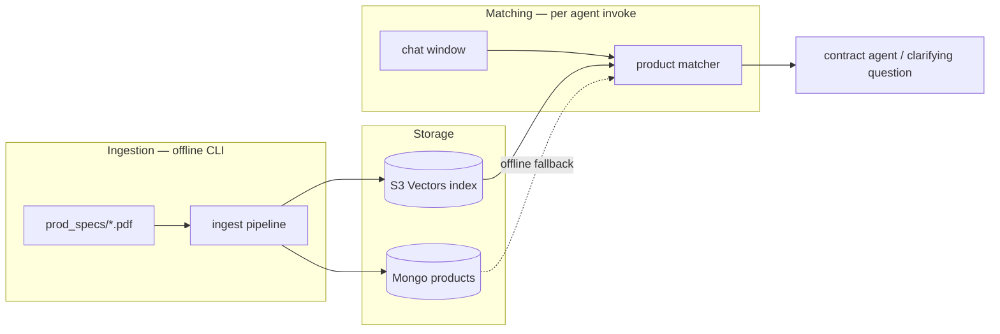
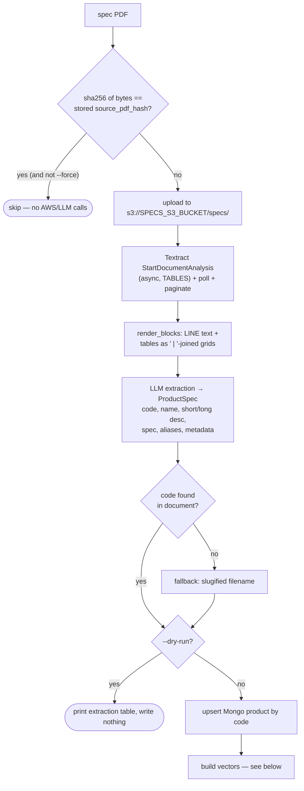
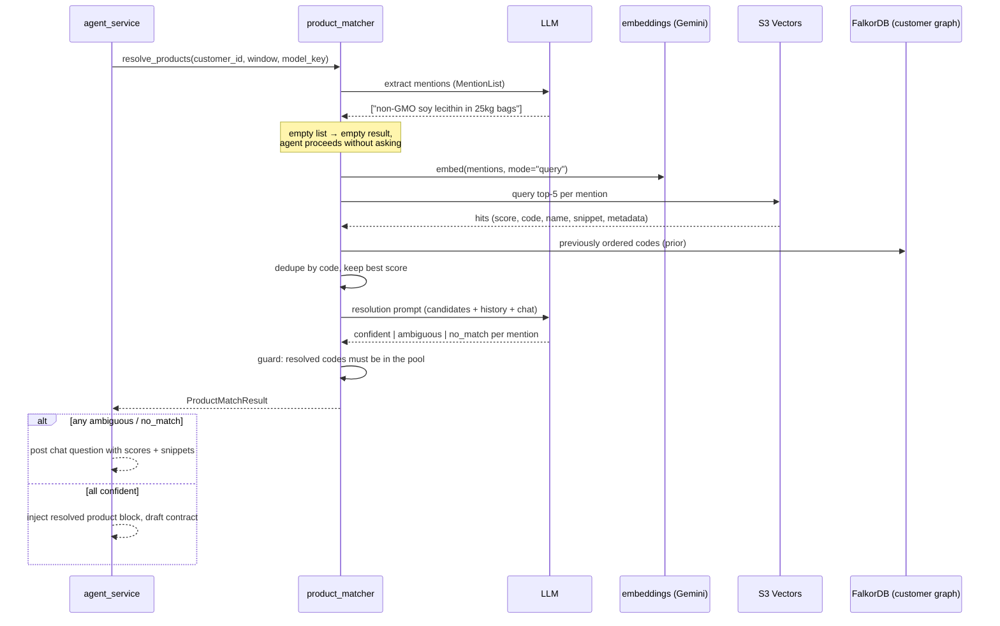
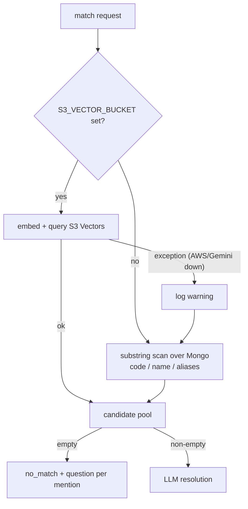

# Embeddings & Vector Search

How the product matcher resolves chat mentions ("send the non-GMO soy
lecithin") to catalog SKUs using embeddings in Amazon S3 Vectors. This
replaced the FalkorDB product catalog graph; customer/chat graphs are
unaffected.

There are two independent flows sharing one vector index:

1. **Ingestion** (offline CLI) — spec PDFs become product records and vectors.
2. **Matching** (runtime) — chat text becomes queries against those vectors.

## Ingestion pipeline

`python -m scripts.ingest_specs prod_specs/ [--model openai:5.5] [--dry-run] [--force] [--workers 15]`

The CLI sweeps a folder of spec PDFs with a thread pool (15 workers by
default, one PDF per worker) and prints per-file progress
(`[upload] → [ocr] → [llm] → [embed] → [done]`). PDFs are the **source of
truth**: extraction creates or overwrites the Mongo product record. Code
lives in `apps/api/services/spec_ingest_service.py`.

Details worth knowing:

- **Textract is async** because multi-page PDFs can only be read from S3 —
  that's why even `--dry-run` uploads the PDF and runs Textract (it just
  writes nothing to Mongo or the index).
- **Tables matter.** Spec sheets keep their attributes (moisture, density,
  packing) in tables, so we request the `TABLES` feature and render each
  table as a grid so the extraction LLM sees rows intact.
- **Idempotency.** The PDF byte hash (`source_pdf_hash`, looked up by
  `source_pdf`) short-circuits unchanged files before any AWS or LLM call.
  Per-file failures are collected into a report table (exit code 1 if any
  failed); one bad PDF never stops the sweep.

## What gets embedded

`apps/api/services/product_embedding_service.py` builds up to three kinds of
vectors per product, with deterministic keys so re-ingestion overwrites
cleanly:

| Key | Embedded text | Catches |
|---|---|---|
| `{code}#main` | name + short + long description + metadata as text | name/description-shaped mentions ("sunflower lecithin powder") |
| `{code}#spec` | spec string + metadata block | attribute-led mentions ("de-oiled powder for aquafeed, 25kg bags") |
| `{code}#alias#{n}` | alias + name | bare aliases and codes ("PL5") |

Every vector carries metadata: `code`, `name`, `kind`, the product's
flattened `metadata` dict (all filterable), and `snippet` — the first 300
chars of the embedded text (non-filterable; it powers the "why it matched"
line in clarifying questions).

The embedding model is **`gemini-embedding-001`** (`core/embeddings.py`) at
1536 dimensions. Two things are easy to miss:

- Gemini only auto-normalizes at 3072 dims, so we **L2-normalize** the 1536-dim
  vectors ourselves — otherwise cosine distance is meaningless.
- Documents and queries use different task types (`RETRIEVAL_DOCUMENT` at
  build time, `RETRIEVAL_QUERY` at match time), which measurably improves
  retrieval.

After vectors land, the product doc gets `embedded_hash` (hash of the
embedded texts) and `vector_keys`. `status_for_doc` compares that hash
against the doc's current content — `built` / `stale` / `not built` — with
no S3 call, which is what the Products page badge and `POST
/api/products/{id}/build` use.

## The vector store

`apps/api/db/vectors.py` wraps two interchangeable indexes behind the same
`put` / `query` / `delete` / `ensure` surface:

- **`S3VectorsIndex`** — the real store, via the boto3 `s3vectors` client.
  `ensure()` creates the vector bucket and index on first use (cosine
  metric, 1536 dims, `snippet` marked non-filterable). Queries return
  `score = 1 - distance`, so higher is always better.
- **`InMemoryIndex`** — a ~25-line numpy cosine index used by tests and
  offline development.

`is_available()` is simply "is `S3_VECTOR_BUCKET` configured" — runtime
errors are handled by fallback (below), not by pinging AWS on every match.

## Runtime matching

`apps/api/services/product_matcher_service.py`, invoked from
`agent_service.invoke` before drafting a contract:

The design principle: **vectors get the right ~5 products into the room;
the resolution LLM applies the precise constraints.** Embeddings are fuzzy —
they rank the GM and non-GM lecithin variants side by side and can't compare
"moisture ≤ 2%". So the top-k candidates go into the resolution prompt with
their similarity score, matched snippet, and full structured metadata, and
the LLM does the exact attribute reasoning (and cites the differing
attribute when it has to ask).

Stage by stage:

1. **Mention extraction** — a small structured LLM call returns mention
   phrases with qualifiers kept attached ("non-GMO soy lecithin in 25kg
   bags", never just "soy lecithin"), so those words reach the embedding.
   An empty list is a valid answer and short-circuits everything.
2. **Vector search** — each mention is embedded (query mode) and queried
   top-5; hits across mentions are deduped by product code keeping the best
   score (an alias hit and a main hit for the same product collapse into one
   candidate).
3. **History prior** — previously-ordered codes from the customer graph are
   added to the pool at score 0.0 and listed separately in the prompt as a
   tie-breaker.
4. **Resolution** — the LLM assigns each mention `confident` (one clear
   winner), `ambiguous` (2+ fit → directed question), or `no_match`
   (question). A guard downgrades any `confident` answer whose code isn't in
   the pool — the LLM can never invent a SKU.
5. **Disambiguation** — ambiguous/no_match questions render each candidate
   as `Name (CODE, 0.87 — "matched snippet")`, so the user sees *why* each
   option came up.

## Degradation & failure handling

- Vector-store or embedding failures never reach the chat flow: the matcher
  logs a warning and falls back to a substring scan over the Mongo product
  docs — the app works offline, just with dumber matching.
- `build_from_doc` is a no-op when vectors aren't configured, so creating or
  editing products locally never errors.
- A crash mid-build leaves the product `stale` (the `embedded_hash` is only
  written after vectors land); re-running the build fixes it.

## Configuration

| Env var | Default | Used for |
|---|---|---|
| `SPECS_S3_BUCKET` | — (required to ingest) | PDF uploads / Textract input |
| `S3_VECTOR_BUCKET` | — (required for vector search) | S3 Vectors bucket; unset ⇒ fallback matching |
| `S3_VECTOR_INDEX` | `product-catalog` | index name inside the vector bucket |
| `AWS_REGION` | `us-east-1` | Textract, S3, S3 Vectors clients |
| `GEMINI_API_KEY` / `GOOGLE_API_KEY` | — | `gemini-embedding-001` embeddings |

## Code map

| Module | Responsibility |
|---|---|
| `scripts/ingest_specs.py` | CLI: sweep folder, progress + report table, exit code |
| `apps/api/services/spec_ingest_service.py` | Textract, LLM extraction, Mongo upsert, per-file orchestration |
| `apps/api/services/product_embedding_service.py` | render → embed → write vectors; build status; vector cleanup |
| `apps/api/db/vectors.py` | `S3VectorsIndex` + `InMemoryIndex` behind one interface |
| `core/embeddings.py` | Gemini embedding client (1536-dim, normalized, doc/query modes) |
| `apps/api/services/product_matcher_service.py` | mention extraction, vector search, fallback, LLM resolution |
| `apps/api/services/agent_service.py` | invokes the matcher; renders clarifying questions with scores/snippets |

Design history: `docs/superpowers/specs/2026-07-28-product-matcher-embeddings-design.md`
and the implementation plan in `docs/superpowers/plans/`.
