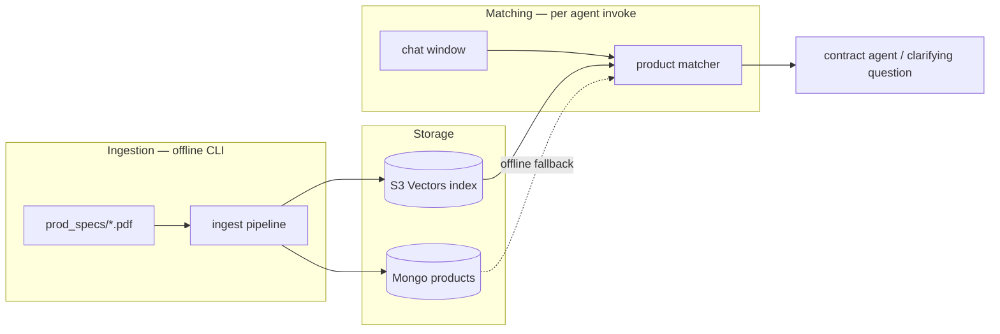
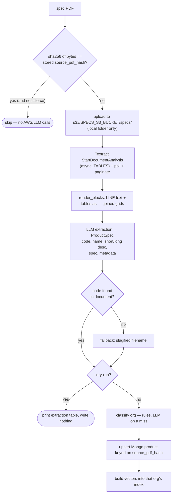
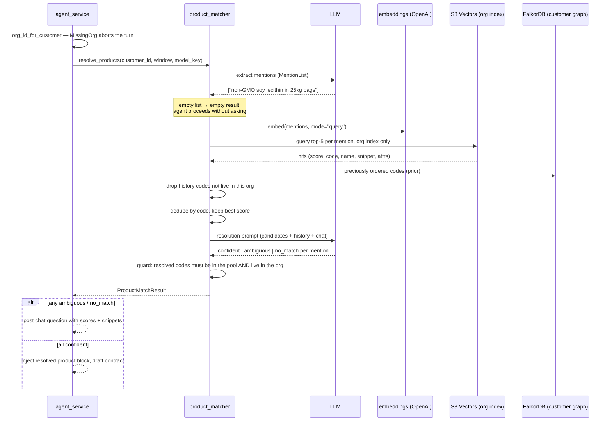
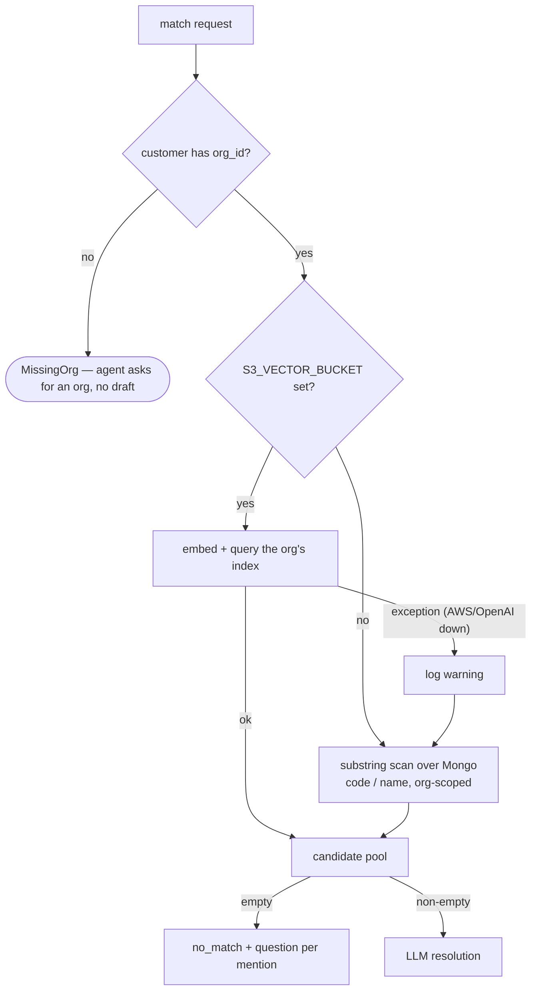

# Embeddings & Vector Search

How the product matcher resolves chat mentions ("send the non-GMO soy
lecithin") to catalog SKUs using embeddings in Amazon S3 Vectors. This
replaced the FalkorDB product catalog graph; customer/chat graphs are
unaffected.

There are two independent flows, each using per-organization vector indexes.
`S3_VECTOR_INDEX` is a **prefix** — the real index for an org is
`{S3_VECTOR_INDEX}-{slug}`, stored on the org document as `vector_index`.
The agent queries only the index that belongs to the customer's org:

1. **Ingestion** (offline CLI) — spec PDFs become product records and vectors.
2. **Matching** (runtime) — chat text becomes queries against those vectors.



## Ingestion pipeline

`python -m scripts.ingest_specs <folder|s3://bucket/prefix> [--model openai:5.5] [--dry-run] [--force] [--workers 15]`

The CLI sweeps a folder of spec PDFs with a thread pool (15 workers by
default, one PDF per worker) and prints per-file progress
(`[upload] → [ocr] → [llm] → [embed] → [done]`). PDFs are the **source of
truth**: extraction creates or refreshes the Mongo product record. Code
lives in `apps/api/services/spec_ingest_service.py`.

The `folder` argument takes either form:

- **local folder** → `ingest_pdf` uploads each PDF to
  `s3://SPECS_S3_BUCKET/specs/` and tags the product `source_label: "OG Files"`.
- **`s3://bucket/prefix`** → `ingest_pdf_from_s3` reads the objects in place,
  never copying anything into `SPECS_S3_BUCKET`, and tags them
  `source_label: "Test Files"`. That label is what the Products page's source
  filter switches on.



Details worth knowing:

- **Identity is the PDF, not the code.** `upsert_product` keys on
  `source_pdf_hash`, so re-extracting the same sheet can never fork one
  product into two. When a document already exists for those bytes, its
  `code` and `org_id` are left exactly as first ingested and only the
  descriptive fields are refreshed.
- **Two collision paths.** A `code` that already belongs to a *different*
  spec sheet raises `CodeCollision` and the file is reported as `conflict`.
  A `code` held by a seeded or hand-created product with no spec sheet is
  claimed — but its `org_id` is deliberately left alone, because moving an
  org has to go through `PUT /api/products/{id}` so vectors get re-indexed.
  Losing an insert race raises `DuplicatePdf`.
- **Org classification runs at ingest.** `org_classifier_service.classify`
  assigns `org_id` for genuinely new products (see below).
- **Textract is async** because multi-page PDFs can only be read from S3 —
  that's why even `--dry-run` uploads the PDF and runs Textract (it just
  writes nothing to Mongo or the index).
- **Tables matter.** Spec sheets keep their attributes (moisture, density,
  packing) in tables, so we request the `TABLES` feature and render each
  table as a grid so the extraction LLM sees rows intact.
- **Idempotency.** The PDF byte hash (`source_pdf_hash`, looked up by
  `source_pdf`) short-circuits unchanged files before any AWS or LLM call.
  Per-file failures are collected into a report table (exit code 1 if any
  failed); one bad PDF never stops the sweep.
- **Multi-code spec sheets.** Pack-size tables often make the extractor
  return several codes at once (`"1510010515022, 15100105"`).
  `_canonical_code` keeps the shortest — the longer siblings are
  pack-suffixed extensions of the base SKU.

## Organizations own the catalog

The catalog is partitioned across fictional selling organizations
(`apps/api/orgs.py`), and **every product and customer belongs to exactly
one**. Each org owns its own vector index, so the agent only ever searches
the catalog its customer is allowed to buy from.

`org_classifier_service.classify` assigns a product in two passes across
**all** rules — every rule's `metadata.category` set first, then every
rule's keyword pattern. That ordering is load-bearing: several products
mention a competing org's keywords in passing, and a single-pass
first-hit-wins loop misfiles them. Keyword matching deliberately reads only
`code`, `name` and `short_description`, because long descriptions routinely
name competing products ("partially replaces DL-methionine and choline
chloride"). A rule miss falls through to an LLM call, and any failure or
unknown `org_id` lands in the catch-all org.

Customers are assigned an org automatically on API startup
(`seed.migrate_orgs`). Products are not — classification can call an LLM, so
it is an explicit step:

```bash
python -m scripts.assign_orgs --dry-run          # preview code → org
python -m scripts.assign_orgs                    # write org_id
python -m scripts.assign_orgs --rebuild-vectors  # and re-embed per org
```

Products with no `org_id` are invisible to every customer's agent, are
skipped by `POST /api/products/build-all`, and are rejected by
`POST /api/products/{id}/build`.

## What gets embedded

`apps/api/services/product_embedding_service.py` builds up to two vectors
per product, with deterministic keys so re-ingestion overwrites cleanly.
Keys are prefixed with the product's **Mongo `_id`**, not its code, so
renaming a code never orphans a vector:

| Key | Embedded text | Catches |
|---|---|---|
| `{_id}#main` | name + short + long description + metadata as text | name/description-shaped mentions ("sunflower lecithin powder") |
| `{_id}#spec` | spec string + metadata block | attribute-led mentions ("de-oiled powder for aquafeed, 25kg bags") |

The `#spec` vector is only written when the product actually has a `spec`
or `metadata`; a product with neither owns just `#main`.

Every vector carries metadata: `code`, `name`, `kind`, `attrs`, and
`snippet`. Two of those need explaining:

- **`attrs`** is the product's `metadata` dict **JSON-encoded into a single
  string**, not spread across filterable keys. S3 Vectors caps filterable
  metadata at 2048 bytes, and real spec sheets blow through that, so `attrs`
  is registered as non-filterable and unpacked again by the matcher.
- **`snippet`** is the first 300 chars of the embedded text, also
  non-filterable. It powers the "why it matched" line in clarifying
  questions.

The embedding model is **`text-embedding-3-large`** (`core/embeddings.py`)
at **3072 dimensions**. Two things are easy to miss:

- `text-embedding-3` models return **unit-norm vectors natively**, so
  nothing normalizes them by hand. (An earlier Gemini client did need manual
  L2 normalization — that code is gone.)
- `embed()` still takes a `mode="document" | "query"` argument, but OpenAI
  has no document/query task-type distinction, so **it has no effect**. It
  is kept only for interface compatibility with the call sites.

After vectors land, the product doc gets `embedded_hash`, `vector_keys`, and
`vector_index` (the index the vectors actually went into). `status_for_doc`
recomputes the hash from the doc's current content and compares —
`built` / `stale` / `not built` — with no S3 call, which is what the
Products page badge, the Organizations page's embedding-health line, and
`POST /api/products/{id}/build` all use. The hash covers `org_id` as well as
the embedded texts, so moving a product between orgs correctly reads as
stale.

Two lifecycle operations are easy to get wrong and are handled explicitly:

- **Deleting a product** removes vectors *before* the Mongo document, since
  both the keys and the index they live in are read off that document.
  `vector_index` is preferred over the org's current index, so a product
  whose org changed without a rebuild still cleans up correctly.
- **Moving a product between orgs** (`move_org`) drops the old vectors,
  clears the build fields, then re-embeds into the new org's index. The
  document is deliberately left unbuilt between those halves, so a failed
  rebuild surfaces as "not built" rather than as a product that looks
  embedded but has no vectors anywhere.

## The vector store

`apps/api/db/vectors.py` wraps two interchangeable indexes behind the same
`put` / `query` / `delete` / `ensure` surface:

- **`S3VectorsIndex`** — the real store, via the boto3 `s3vectors` client.
  `ensure()` creates the vector bucket and index on first use (cosine
  metric, 3072 dims, with `snippet` and `attrs` marked non-filterable).
  Queries return `score = 1 - distance`, so higher is always better.
- **`InMemoryIndex`** — a ~25-line numpy cosine index used by tests and
  offline development.

There is **one index per organization**, not one global index.
`index_named(name)` builds a handle for a given index name, and
`org_service.vector_index_name(org_id)` decides what that name is — reading
the `vector_index` field stored on the org document rather than deriving it
fresh, so changing `S3_VECTOR_INDEX` later cannot orphan existing vectors.
It falls back to the derived `{S3_VECTOR_INDEX}-{slug}` only when the org
document is absent.

`is_available()` is simply "is `S3_VECTOR_BUCKET` configured" — runtime
errors are handled by fallback (below), not by pinging AWS on every match.

## Runtime matching

`apps/api/services/product_matcher_service.py`, invoked from
`agent_service.invoke` before drafting a contract:



The design principle: **vectors get the right ~5 products into the room;
the resolution LLM applies the precise constraints.** Embeddings are fuzzy —
they rank the GM and non-GM lecithin variants side by side and can't compare
"moisture ≤ 2%". So the top-k candidates go into the resolution prompt with
their similarity score, matched snippet, and full structured metadata, and
the LLM does the exact attribute reasoning (and cites the differing
attribute when it has to ask).

Stage by stage:

1. **Mention extraction** — a small structured LLM call returns mention
   phrases with qualifiers kept attached ("non-GMO soy lecithin in 25kg
   bags", never just "soy lecithin"), so those words reach the embedding.
   An empty list is a valid answer and short-circuits everything.
2. **Vector search** — each mention is embedded (query mode) and queried
   top-5 against **the customer's org index only**; hits across mentions are
   deduped by product code keeping the best score (a `#main` hit and a
   `#spec` hit for the same product collapse into one candidate). The
   packed `attrs` JSON is unpacked back into the candidate's `metadata`
   here.
3. **History prior** — previously-ordered codes from the customer graph are
   added to the pool at score 0.0 and listed separately in the prompt as a
   tie-breaker. They are filtered against the org's live codes first, for
   two reasons: the graph stores a line item's free-text `description` in
   `LineItem.product_code` (so strings like "FRUCTOPURE TM 700" come back
   looking like SKUs), and a code belonging to another org is something this
   customer cannot buy here.
4. **Resolution** — the LLM assigns each mention `confident` (one clear
   winner), `ambiguous` (2+ fit → directed question), or `no_match`
   (question). A guard downgrades any `confident` answer whose code isn't
   both in the pool and live in the org — the LLM can never invent a SKU or
   reach across orgs.
5. **Disambiguation** — ambiguous/no_match questions render each candidate
   as `Name (CODE, 0.87 — "matched snippet")`, so the user sees *why* each
   option came up.

## Degradation & failure handling



- Vector-store or embedding failures never reach the chat flow: the matcher
  logs a warning and falls back to a substring scan over the Mongo product
  docs — the app works offline, just with dumber matching. The fallback is
  org-scoped too, and matches on `code` and `name` only.
- A customer with no `org_id` is the one case that is *not* soft: there is no
  catalog to search, so `agent_service.invoke` catches `MissingOrg` and posts
  a question telling the user to assign an organization.
- `build_from_doc` is a no-op when vectors aren't configured, so creating or
  editing products locally never errors — but it raises `MissingOrg` if the
  product has no org, since there would be no index to write to.
- A crash mid-build leaves the product `stale` (the `embedded_hash` is only
  written after vectors land); re-running the build fixes it.

## Configuration

| Env var | Default | Used for |
|---|---|---|
| `SPECS_S3_BUCKET` | — (required to ingest) | PDF uploads / Textract input |
| `S3_VECTOR_BUCKET` | — (required for vector search) | S3 Vectors bucket; unset ⇒ fallback matching |
| `S3_VECTOR_INDEX` | `product-catalog-openai` | prefix for per-org indexes; each org's index is `{S3_VECTOR_INDEX}-{slug}` |
| `AWS_REGION` | `us-east-1` | Textract, S3, S3 Vectors clients |
| `OPENAI_API_KEY` | — | `text-embedding-3-large` embeddings |

## Code map

| Module | Responsibility |
|---|---|
| `scripts/ingest_specs.py` | CLI: sweep a local folder or `s3://` prefix, progress + report table, exit code |
| `scripts/assign_orgs.py` | CLI: classify products into orgs, optionally re-embed per org |
| `apps/api/services/spec_ingest_service.py` | Textract, LLM extraction, org classification, Mongo upsert, per-file orchestration |
| `apps/api/services/org_classifier_service.py` | product → org: two-pass deterministic rules, LLM on a miss, catch-all on failure |
| `apps/api/services/org_service.py` | org roster, slugs, and which vector index an org owns; raises `MissingOrg` |
| `apps/api/services/product_embedding_service.py` | render → embed → write vectors; build status; vector cleanup; cross-org moves |
| `apps/api/db/vectors.py` | `S3VectorsIndex` + `InMemoryIndex` behind one interface |
| `core/embeddings.py` | OpenAI embedding client (`text-embedding-3-large`, 3072-dim, natively unit-norm) |
| `apps/api/services/product_matcher_service.py` | mention extraction, org-scoped vector search, fallback, LLM resolution |
| `apps/api/services/agent_service.py` | invokes the matcher; renders clarifying questions with scores/snippets |
