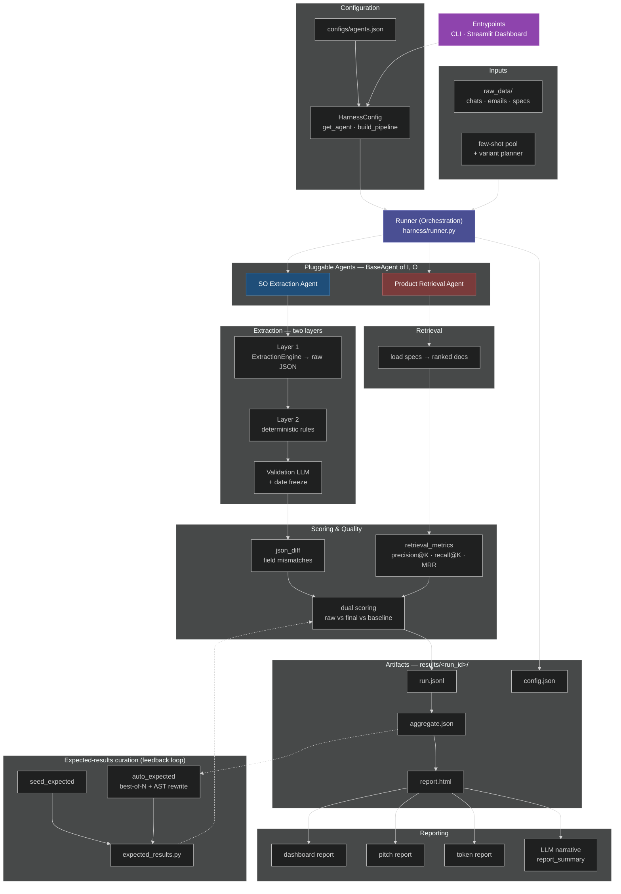
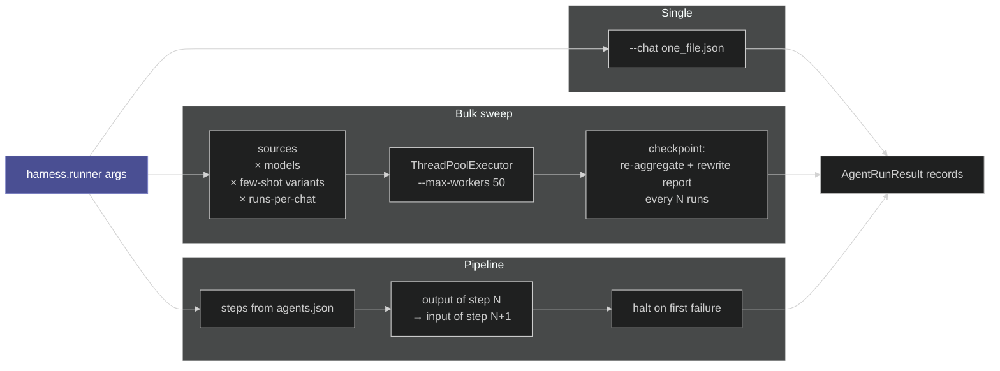
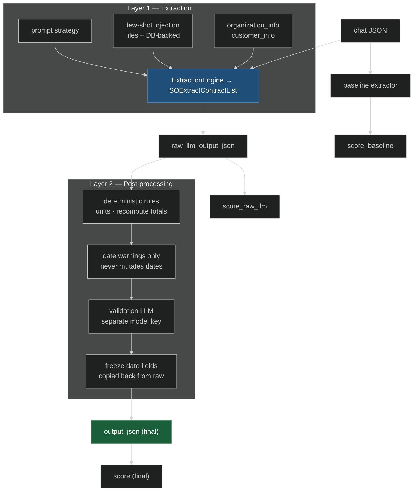
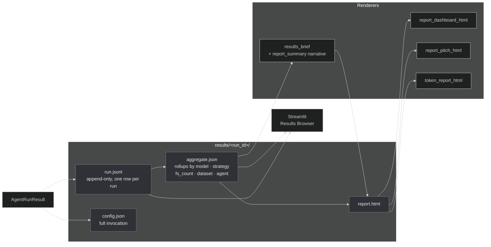
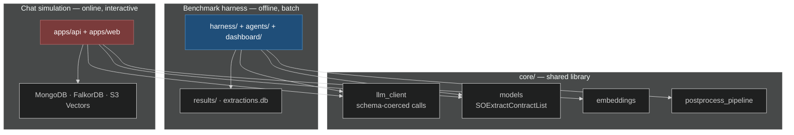

# Agent Harness — Architecture

A visual map of the **benchmark harness**: how a chat file becomes a scored,
reported run. For the task-oriented walkthrough (configuring agents, CLI
recipes, few-shot modes) see [`multi_customer_harness.md`](multi_customer_harness.md).
For the *other* system in this repo — the live chat-simulation app under
`apps/` — see [`architecture.md`](architecture.md).

> The diagrams below pin `theme: dark`. Drop the `%%{init: …}%%` line from any
> block if you'd rather it follow the reader's GitHub theme.

---

## The harness at a glance

**Reading it:** everything funnels through one orchestrator. `agents.json` is
the only place an agent is declared; the runner is generic over whatever it
finds there and never imports a concrete agent.

---

## Run modes

The runner has three modes off one argument parser. Bulk is the interesting
one — it is a **four-way cross product**, which is why a "small" sweep can be
thousands of LLM calls.

Few-shot selection is its own axis with four mutually exclusive modes —
`explicit` / `walk` / `sweep` / `none` — planned up front by
`harness/fewshot.py` so a sweep is reproducible from `--few-shot-seed`.

---

## The two-layer extraction agent

`SOExtractionAgent` is the only fully-built agent. It wraps the `core/`
extraction library and keeps **both** snapshots so post-processing can be
measured rather than assumed.

Two invariants worth carrying in your head:

- **Dates are never auto-corrected.** The deterministic stage emits warnings
  only, and every date field is copied back verbatim from the raw extraction
  after the validation LLM runs. Everything else (units, totals) may be fixed.
- **Downstream consumers use `output_json`.** `raw_llm_output_json` is kept
  purely so the report can show what post-processing changed.

---

## Artifacts and reporting

One folder per run, written incrementally so a long sweep is inspectable
while it is still going.

`config.json` exists so the dashboard can reload and re-run an invocation
exactly. `report.html` is rewritten at every checkpoint; the LLM narrative
layer is only generated on the final write (and skipped entirely with
`--no-report-llm`).

---

## Two systems, one `core/`

The repo name is plural for a reason — there are two independent runtimes,
and they meet only at the shared extraction library.

They share schemas and the LLM client, but **not** state: the harness scores
against curated `expected_results.py` fixtures and writes to `results/` and
SQLite, while the app writes to Mongo, FalkorDB and S3 Vectors. Neither reads
the other's stores.

---

## Component map

| Box in the diagram | Code |
|---|---|
| Configuration | `configs/agents.json`, `agents/config.py::HarnessConfig` |
| Agent contract | `agents/base.py::BaseAgent` (`load_input` · `run_one` · `expected_for` · `score`) |
| Pipeline | `agents/base.py::Pipeline` |
| Orchestration | `harness/runner.py` (`_run_bulk` · `_run_pipeline`) |
| Few-shot planning | `harness/fewshot.py::plan_few_shot_variants` |
| SO extraction agent | `agents/so_extraction/agent.py::SOExtractionAgent` |
| Two-layer extraction | `core/extractor.py`, `core/postprocess_pipeline.py` |
| Retrieval agent (scaffold) | `agents/product_retrieval/agent.py` |
| Scoring | `harness/scoring.py::json_diff`, `::retrieval_metrics` |
| Run record | `agents/base.py::AgentRunResult` |
| Artifacts | `harness/artifacts.py` (`append_record` · `aggregate` · `write_report`) |
| Reports | `harness/report_dashboard_html.py`, `report_pitch_html.py`, `token_report_html.py`, `report_summary.py`, `results_brief.py` |
| Expected curation | `harness/seed_expected.py`, `harness/auto_expected.py` |
| UI | `dashboard/app.py` (Single · Bulk · Results · Seed · Auto tabs) |
